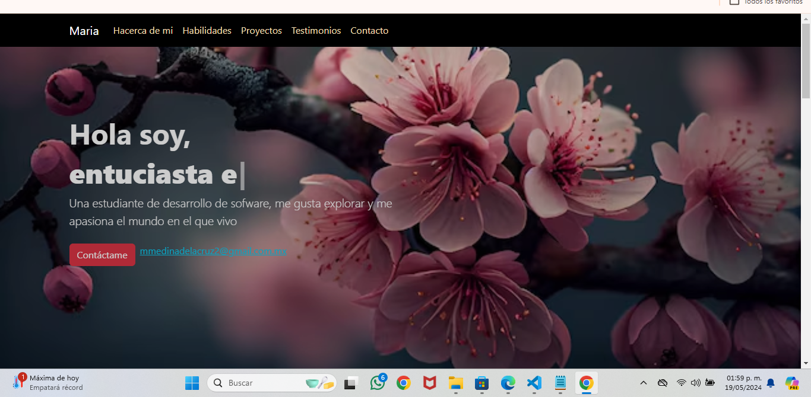
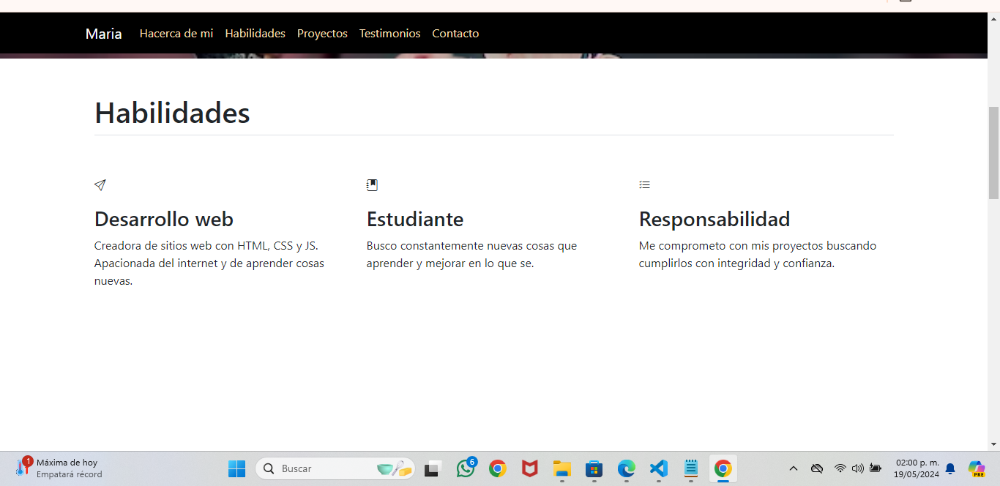
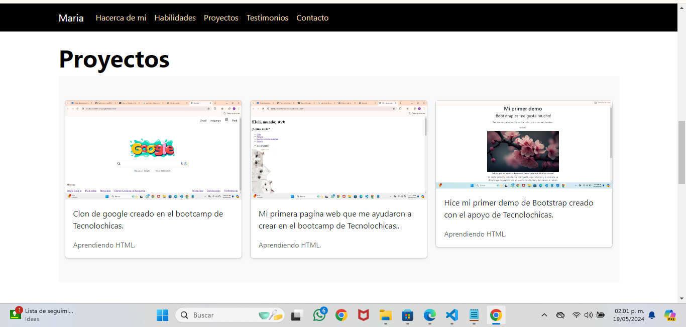
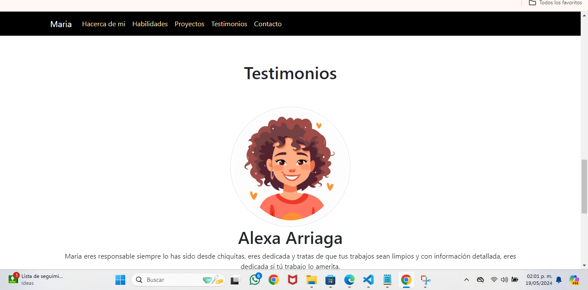
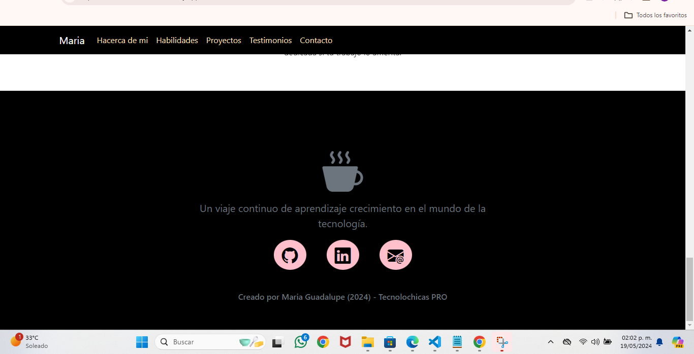

# Mi portafolio de Tecnolochicas PRO

Este portafolio es desarrollado para poner en practica las habilidades obtenidas dentro del bootcamp de desarrollo frontend.

Fue desarrollado con HTM, CSS y JS con el uso de framework Bootstrap utilizando animaciones de bibliotecas externas.

[Proyecto en linea](https://miportafolio-maria-medina.netlify.app/)

-Capturas de pantalla

-Tecnologias
*HTML
*CSS
*Javascript
*Bootstrap 5

Ocupe bibliotecas extra.

Creado por Maria Guadalupe en el bootcamp de Tecnolochicas PRO.